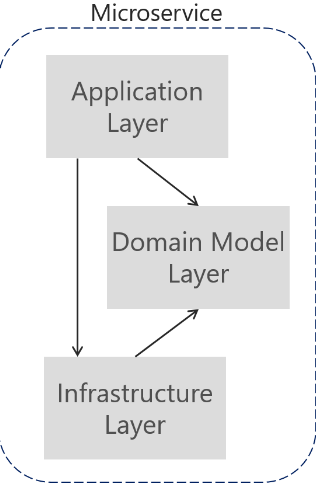
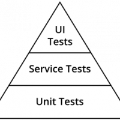

## Architecture

For the design of PaymentAPI I used DDD + CQRS + Event Sourcing, I will explain a little bit why the use of these three architectures patters.

### DDD

Domain Driven Design it's a design pattern for dealing with highly complex domains that is based on making the domain itself the main focus of the project.

Also it helps to decouple the different layers of your program(Application, Domain, Infrastructure) making it more extensible and easy to port each of the layers into another program if it's needed.

In PaymentAPI I implemented three modules described like:

* **Application**: Layer which normally is the entry point of your app. It has dependency with domain and infrastructure modules.
* **Domain**: Layer where you implement the business logic of your application. It does not have any dependency.
* **Infrastructure**: Layer where you implement the communication with the backends (Database, services, Brokers). It has dependency with domain.



### CQRS

Command Query Responsibility Segregation it's another Design pattern, mostly divulged by **Greg Young** which segregate the model of Commands and Queries
in your architecture to do Writes and Reads separated. It can give you the chance to make the Queries more efficient since normally in a Cluster the 90% of the traffic
is for Queries.

In PaymentAPI I implemented Handler for Commands and Service to deal with Queries.

* **Handler**: Receives commands and transforms the Command into Domain model, to pass the responsibility to the domain, and finally into the infrastructure.
* **Service**: Receives Queries and invokes directly to the DAO in the infrastructure layer.

### Event Sourcing

Event sourcing is a design pattern where you work with Events. The main idea of Event sourcing is to keep and persist the state of your program, without mutating previous states.

That means that with Event sourcing I'm not deleting any data in the system, giving us the possibility to have an historical about the different state of one Payment.

In PaymentAPI, Event sourcing together with CQRS, allow us persist events in order to keep state and have historical data. 

* **PaymentAdded**: Event that keep the state of the creation of a payment.
* **PaymentUpdated**: Event that keep the state of the change of a payment.
* **PaymentDeleted**: Event that keep the state of the deletion of a payment.

### API

The design of the API is based on Restful design, so for Queries I used **GET**, for create **POST**, update **PUT** and delete **DELETE**

Since the root of the endpoints is `/v1/payment` many of the endpoints do not require any extra word, only arguments as `Query param`

```.java
@Path("/v1/payment")
@Produces(MediaType.APPLICATION_JSON)
@Consumes(MediaType.APPLICATION_JSON)
public class PaymentResource {

    @GET
    @Path("/all")
    public CompletionStage<PaymentResponse<?>> fetchAllPayment() 
    
    @GET
    @Path("/{paymentId}")
    public CompletionStage<PaymentResponse<?>> fetchPaymentById(@PathParam("paymentId") String id)
    
    @POST
    @Path("/")
    public CompletionStage<PaymentResponse<String>> addPayment(AddPaymentCommand addPaymentCommand)   
    
    @PUT
    @Path("/{paymentId}")
    public CompletionStage<PaymentResponse<String>> updatePayment(@PathParam("paymentId") String paymentId,
                                                                  UpdatePaymentCommand updatePaymentCommand)
    @DELETE
    @Path("/{paymentId}")
    public CompletionStage<PaymentResponse<String>> deletePayment(@PathParam("paymentId") String paymentId)                                                                        
}
```

## Testing



**To go fast you have to go well** this quote of Robert C. Martin express perfectly what TDD and BDD is. You should think first in all corner cases of your program, and then implement 
one by one committing every scenario to have a quick feedback about your program.
 
In our application I invested around 70% of the time implementing the test framework, from the most concrete type of testing(Unit) to higher level of Integration.

* **Unit**: I used JUnit5 together with Mockito to Mock external resources of your class.
* **Integration**: I used Quarkus server, which include a very nice Test framework to do BDD and run the application and test all layers of your application.
Just to be clear, the IT test are just a proof that our Unit test are well designed and the Mock behaves as I expect. None IT test should ever fail. And if it does, 
you have to reproduce it in Unit test.
* **Performance**: Performance/Stress test are meant to be used to detect possible concurrency issue in your application,
                   and also to have a control of the latency of your endpoints.
                   Quarkus seems like it does not work with **Gatling** so I just use **@RepeatedTest** of JUnit5.
                   So, no control of latency of endpoints available.
* **Volume**:  Volume test are meant to be used to have a load of traffic for a long period of time, to detect
               some possible memory leaks in your application that it might provoke that your application get 
               out of memory and die. 
               Quarkus seems like it does not work with **Gatling** so I just use **@RepeatedTest** of JUnit5.

## Technology Stack

As Http Server I used **Quarkus**, a new Serverless framework implemented by RedHat team, as a new Power Vertx framework. Indeed a good choice to create Reactive systems.

For the API I used **JAX-RS** standard.

In order to have a reactive system, functional programing it's a powerful tool. Although Java is functional since Java 8 it's not Scala. **Vavr** is good library for functional 
programing that makes you feel like you're in Scala realm again.

To make transformation of models between layer doing DDD, I used **Orika**.

Finally as Connector and Database I chose Cassandra since it's a good choice for Event sourcing.

* **Application**: Quarkus, JAX-RS, Vavr, Mockito

* **Domain**: Vavr, Orika

* **Infrastructure**: Orika, Vavr, Orika, Cassandra, Mockito.


## Use

To run the Unit and Integration test, just go into the root program and run the command:

```
mvn clean install
```

Once that you have your project tested, you just need to run the application. Go to the application module and run the command:

```
./mvnw compile quarkus:dev
```

Then you will have to run the Cassandra embedded that the project provide.

```
CassandraConnector.start()
```

 
## Health check

PaymentAPI provide a health check endpoint to know the state of the service and backends.

```
http://localhost:8080/health
```

##### Response

```
{
    "outcome": "UP",
    "checks": [
        {
            "name": "Payment API health check",
            "state": "UP",
            "data": {
                "Cassandra database": "running"
            }
        }
    ]
}
```
